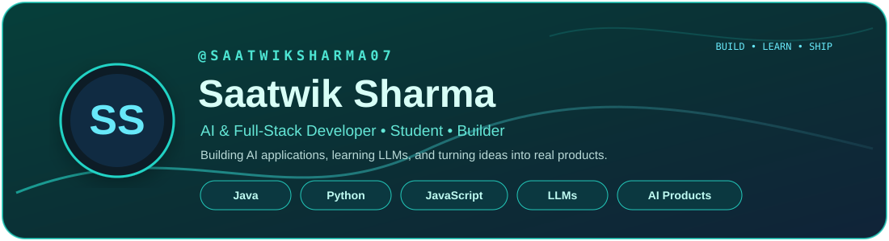
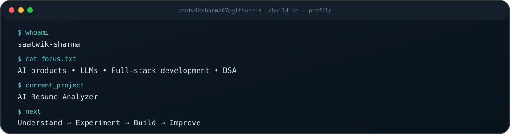

<div align="center">



<br/>

<a href="https://github.com/saatwiksharma07">GitHub</a> •
<a href="https://www.linkedin.com/in/saatwik-sharma-3039723a8/">LinkedIn</a> •
<a href="https://github.com/saatwiksharma07?tab=repositories">Projects</a>

</div>

<br/>



<br/>

## Building intelligent software for real problems

I'm a student and developer focused on **AI applications, LLMs, full-stack development, and problem solving**.

I like going beyond tutorials: **understand the technology, experiment with it, and turn what I learn into useful software.**

Right now, my main focus is **AI products and LLMs**, while strengthening my foundations through **Java, DSA, web development, and software engineering**.

> **Learn the fundamentals. Build the product. Understand what's under the hood. Keep improving.**

---

## 🧠 AI / LLM Lab

I'm exploring AI from two sides: **understanding how the technology works** and **using it to build useful applications**.

<table>
<tr>
<td width="50%">

### 🔬 LLM from Scratch

A hands-on learning project for understanding the building blocks behind language models instead of treating them as a black box.

**Exploring**

`Tokenization` · `Architecture` · `Training` · `Language Modeling`

🔒 **Private • In development**

</td>
<td width="50%">

### 🤖 AI Resume Analyzer

A practical AI product that turns a resume PDF into structured information, ATS-oriented analysis, and career-focused insights.

**Working with**

`PDF Parsing` · `ATS Analysis` · `AI Insights` · `Structured Extraction`

🔨 **Actively building**

</td>
</tr>
</table>

### My approach

**Understand → Experiment → Build → Improve**

I want to understand what's happening under the hood while learning how to turn AI capabilities into products that solve real problems.

---

## 🚀 Selected Projects

<table>
<tr>
<td width="50%">

### 🤖 AI Resume Analyzer

An AI-powered resume platform focused on resume parsing, ATS-related analysis, skill and project extraction, and career-oriented recommendations.

**Status:** 🔨 Building

</td>
<td width="50%">

### 💼 CareerConnect — Job Portal

A polished multi-page job portal designed around a complete job-seeking experience. Users can explore jobs, companies, and career resources, while dedicated login, registration, profile, employer, and application flows make it feel like a real product rather than a single landing page.

**Features:** `Job Search` · `Company Discovery` · `Profiles` · `Applications` · `Employer Flow` · `Responsive UI`

**Stack:** `HTML` · `CSS` · `JavaScript`

<a href="https://github.com/saatwiksharma07/JOB-PORTAL-SITE">View project →</a>

</td>
</tr>
<tr>
<td width="50%">

### ☕ Java Practice

A growing collection of Java programs and problem-solving practice used to strengthen programming fundamentals and DSA thinking.

**Stack:** `Java`

<a href="https://github.com/saatwiksharma07/java">View project →</a>

</td>
<td width="50%">

### 🎨 HTML & CSS

Frontend practice covering layouts, responsive design, styling, grids, and UI experiments.

**Stack:** `HTML` · `CSS`

<a href="https://github.com/saatwiksharma07/HTML-AND-CSS">View project →</a>

</td>
</tr>
</table>

---

## 🛠️ Technologies I Work With

<div align="center">


<br/><br/>


</div>

### Currently exploring

`React` · `Node.js` · `LLM architectures` · `AI product engineering`

> **Stack philosophy:** learn the fundamentals first, then add tools when they help build better products.

---

## 🧭 Developer Journey

```text
Java & DSA
     ↓
Web Development
     ↓
Full-Stack Development
     ↓
LLMs & AI Applications
     ↓
Production-ready AI Products
```

The goal isn't to collect technologies. It's to **understand them well enough to build with them**.

---

## 🏆 Learning & Certifications

### 🎓 Google Skills

Hands-on learning through Google Skills badges, labs, assessments, and technology-focused coursework.

### 📚 Current learning areas

`AI & LLM applications` · `Java & Data Structures` · `Full-stack development` · `Software engineering` · `Project development`

> **Certificates show what I studied. Projects show what I can build.**

---

## 📊 GitHub

<div align="center">


<br/>

<sub>Self-hosted profile stats • automatically refreshed with GitHub Actions</sub>

</div>

---

## 🎯 What I'm Building Toward

**AI Engineer → Full-Stack AI Product Builder**

I'm working toward software where **AI isn't just a feature added at the end — it's part of the product's core experience.**

---

## 🤝 Let's Connect

<div align="center">

If you're interested in **AI, LLMs, full-stack development, open source, or building ambitious products**, let's connect.

<br/><br/>

<a href="https://github.com/saatwiksharma07">

</a>
&nbsp;
<a href="https://www.linkedin.com/in/saatwik-sharma-3039723a8/">

</a>

<br/><br/>

### 🚀 Build. Learn. Ship. Repeat.

</div>
