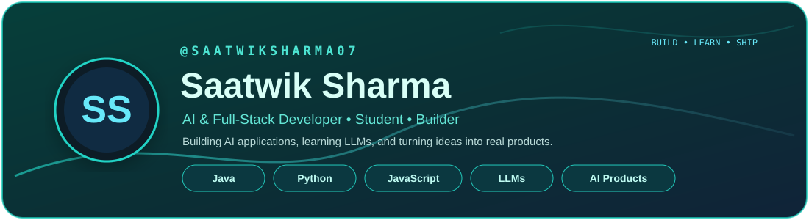

# Saatwik Sharma

### AI/ML • Full-Stack Development • Software Engineering

**I build practical products, experiment with AI, and turn ideas into working software.**

AI Engineering • Full-Stack • LLMs • UI/UX • Java • Python • JavaScript

---

## ⚡ What I Do

**Build • Learn • Experiment • Ship**

I’m a CSE student focused on becoming a strong software engineer with a practical AI/ML foundation.  
My projects combine **AI, full-stack development, modern interfaces, and problem solving**.

---

## 🚀 Featured Projects

<table align="center" width="100%">
<tr>
<td width="50%" valign="top">

### 🎵 SAAVI
**AI-ready Music Experience**

A modern music platform concept focused on personalized discovery, playlists, local music, artist libraries, collaborative playlists, and a premium interactive UI.

**Focus:** Product Engineering · UI/UX · Music Systems

<code>JavaScript</code> <code>React</code> <code>Vite</code>

</td>
<td width="50%" valign="top">

### 🤖 AI Resume Analyzer
**AI-powered career assistant**

Analyzes resumes, extracts structured information, evaluates ATS readiness, and helps users improve their career profile.

**Focus:** AI Products · Resume Intelligence · SaaS

<code>JavaScript</code> <code>PDF.js</code> <code>Supabase</code> <code>Vercel</code>

</td>
</tr>

<tr>
<td width="50%" valign="top">

### 🧠 LLM-from-Scratch
**Learning how language models work**

A hands-on exploration of the foundations behind LLMs, from Python and data processing to neural-network and transformer concepts.

**Focus:** AI/ML · Deep Learning · LLM Engineering

<code>Python</code> <code>PyTorch</code>

</td>
<td width="50%" valign="top">

### 🎞️ DreamFrame
**Creative web experience**

A cinematic interactive web project exploring visual storytelling, animation, and modern product interfaces.

**Focus:** Frontend · Interaction Design · Creative Development

<code>JavaScript</code> <code>React</code> <code>TypeScript</code>

</td>
</tr>
</table>

---

## 🧰 Tech Stack

### Languages

### Development

### AI / Data

  

**Also working with:** PDF.js • Pandas • SQL • Supabase • Vercel

---

## 🎯 Current Focus

- 🧠 Building a stronger foundation in **AI/ML and LLM engineering**
- 💻 Improving **Java, DSA, Python, JavaScript and full-stack development**
- 🚀 Turning projects into **real, usable products**
- 🎨 Designing cleaner and more interactive **UI/UX**
- 🧩 Learning how to build systems that are not just demos, but maintainable software

---

## 📌 What I'm Building Toward

### **AI Engineer × Full-Stack Product Builder**

I want to work at the intersection of:

**Artificial Intelligence + Software Engineering + Product Design**

The goal is simple:

> **Learn deeply. Build consistently. Ship useful things.**

---

## 📊 GitHub Activity

  

**AI × Engineering × Design**

---

### Thanks for visiting 👋

If you find something interesting here, feel free to explore the repositories.

**Keep building. 🚀**

